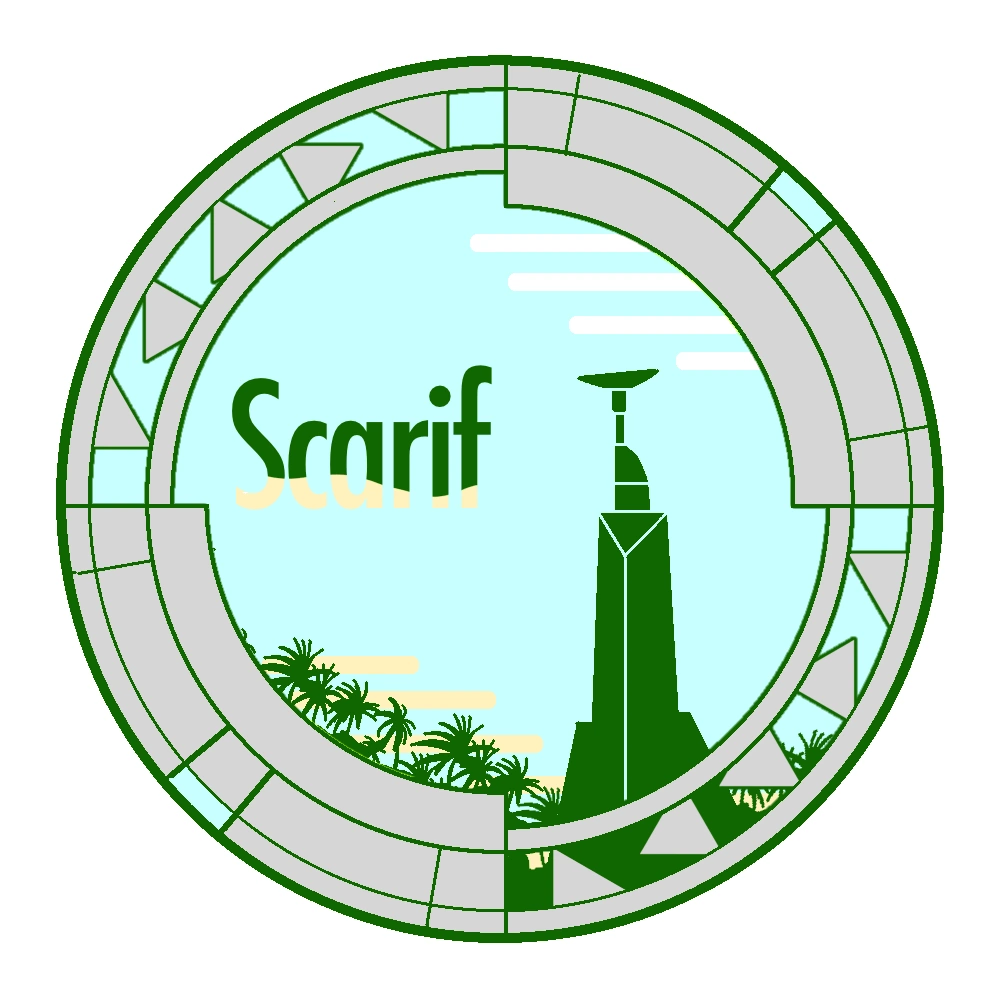

# Scarif

Repositorio del proyecto sobre cienciometría y sistema de gestión de congresos. 
UTN FRC.

# PID UTN
## Nombre formal del proyecto
Análisis cienciométrico de la producción en investigación científica y tecnológica en la Red de Ingeniería en Informática
/ Sistemas de Información de CONFEDI

## Objetivos
### Objetivo general: 
* Caracterizar la producción e impacto de las líneas de investigación que llevan adelante las
universidades pertenecientes a la red RIISIC por medio de una herramienta ad-hoc desarrollada a tal fin.
### Objetivos particulares:
* Modelar la representación de la información asociada a las tareas de I+D que permita caracterizar todos los trabajos producidos por las universidades pertenecientes a la red RIISIC.
* Estructurar un sistema de almacenamiento cienciométrico que permita la registración y consulta de la información registrada.
* Diseñar, desarrollar e implementar un sistema de gestión de congresos y conferencias que registre automáticamente la información en el sistema de almacenamiento, a partir de los papers y artículos presentados, sin necesidad de interacción adicional o carga manual de datos.
* Desarrollar una herramienta de consulta y análisis que permita obtener métricas asociadas a la producción científica y que posibilite analizar los diversos patrones que pudieran surgir a partir del análisis de citas,
autores y líneas de investigación.

## Archivos del PID
* [Archivo de proyecto](documentos/PID/Impresion_PIDCenso.pdf)
* [Resolución de homologación](documentos/PID/Disp.148-homologacion-pids-no-incentivados.pdf)
* [PID DEFINITIVO ](documentos/PID/PID SIUTNCO0007848 - Cienciometría.pdf)

# Nerd Note

El proyecto lleva por nombre (interno) Scarif como una referencia al planeta del mismo nombre que aparece en la película Rogue One de la saga de Star Wars.

En este planeta se encontraba la base de datos general de investigación y desarrollo del Imperio Galáctico y fué el objetivo elegido por los rebeldes para robar los planos de la Estrella de la Muerte y lograr su destrucción.

La referencia apunta a un repositorio de toda la investigación de una organización y al valor de hacer pública dicha información.

### Algunos logos encontrados somewhere

